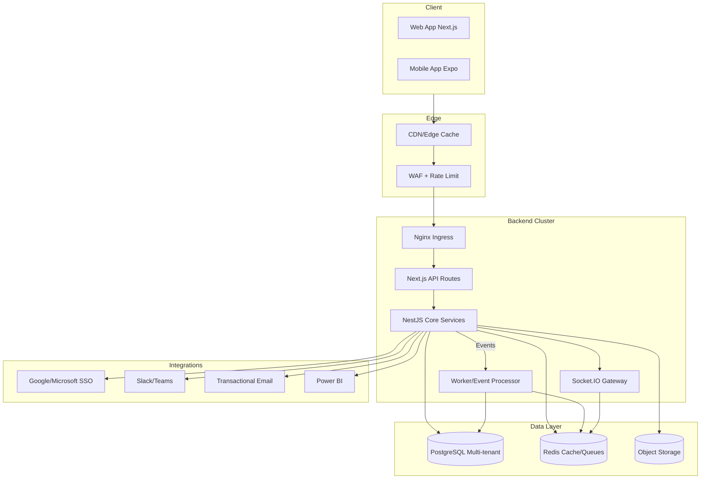
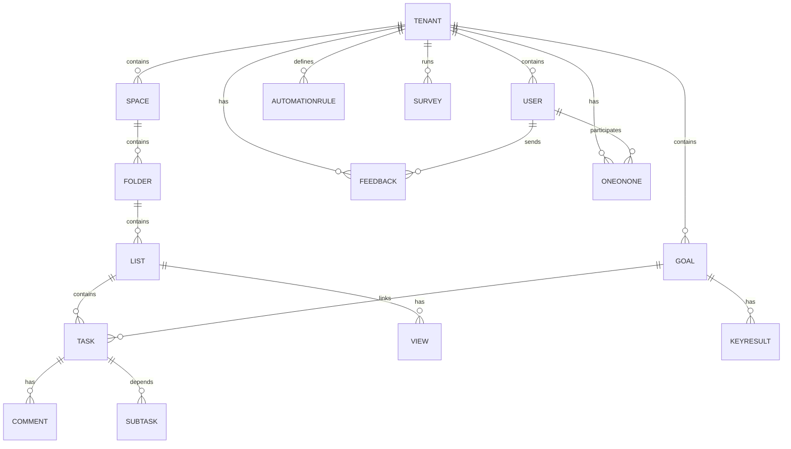
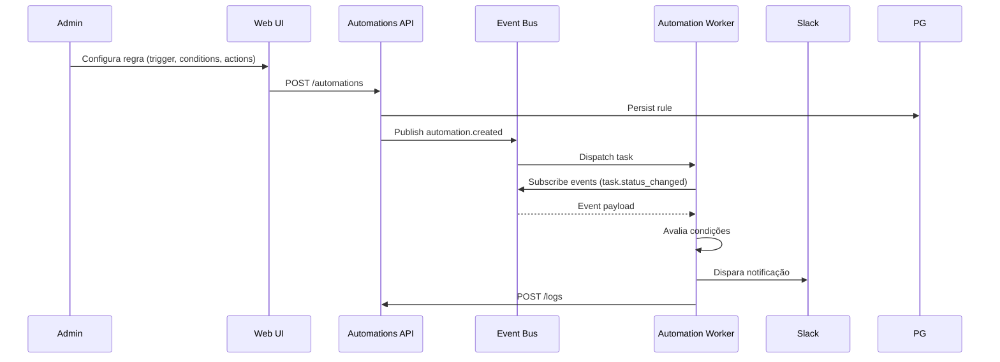

# RFC - Arquitetura CultureUP MVP

## 1. Objetivo
Definir a arquitetura técnica inicial do CultureUP para suportar o MVP multi-tenant B2B, garantindo escalabilidade, segurança e time-to-market rápido inspirado em ClickUp + Qulture.

## 2. Visão Geral
- **Monorepo** com Turbo/PNPM gerenciando apps web (Next.js), mobile (Expo) e backend (NestJS).
- **Arquitetura hexagonal** no backend com CQRS e eventos de domínio.
- **Infraestrutura** em Kubernetes (EKS/GKE) com componentes gerenciados: PostgreSQL, Redis, Object Storage (S3).
- **Observabilidade** via OpenTelemetry + Prometheus + Grafana + Sentry.
- **Segurança**: RBAC multi-tenant, JWT access + refresh, OAuth2 SSO, criptografia TLS e at-rest.

## 3. Diagrama de Componentes

## 4. Fluxo Multi-tenant
- Cada organização possui schema próprio no PostgreSQL (`tenant_{uuid}`) com migrações automatizadas.
- Tabela global `tenants` gerencia metadados e domínios customizados.
- JWT inclui `tenantId` e `role`; middleware assegura isolamento.
- Redis armazena sessões WebSocket com namespace por tenant.

## 5. Comunicação e CQRS
- Controllers NestJS expõem comandos (POST/PUT) e queries (GET) via serviços segregados.
- Event bus interno (Redis Streams) propaga eventos para automations, integrações e AI Assist.
- Projeções materializadas (views JSONB) aceleram dashboards (Workload, Timeline).

## 6. Persistência e Busca
- PostgreSQL com extensões `pgcrypto`, `uuid-ossp`, `pg_trgm`.
- Documentos ricos armazenados em formato JSON (ProseMirror) e versões (auditoria).
- Filtragem avançada via índices GIN em `custom_fields` e `tags`.

## 7. Realtime
- Socket.IO com canal por Workspace e rooms por list/task/doc/goal.
- Eventos broadcast: `task.updated`, `goal.progress`, `feedback.created`, `1on1.updated`.
- Fallback: Server-Sent Events e long-poll.

## 8. AI Assist
- Micro-serviço interno usando OpenAI API (ASSUNÇÃO) encapsulado via worker.
- Prompt engineering com contexto do tenant e políticas de privacidade.
- Logs de uso armazenados em `ai_usage` para billing futuro.

## 9. Segurança & LGPD
- RBAC Owner/Admin/Member/Guest; controle de escopo por módulo.
- Logs imutáveis em `audit_logs` com hash encadeado.
- Criptografia adicional (pgcrypto) para campos sensíveis (feedback privado, notas 1:1).
- Consentimento registrado por usuário, tela de privacy onboarding.

## 10. Observabilidade
- OpenTelemetry SDK em todos os serviços.
- Prometheus Operator coleta métricas; Grafana dashboards para KPIs técnicos.
- Sentry para erros web/mobile/backend.
- Logs estruturados JSON para ELK opcional.

## 11. Diagramas Adicionais
### ERD (alto nível)

### Fluxo de Automação

## 12. Pipeline CI/CD
- GitHub Actions com workflows: lint/test (PR), build docker (main), deploy (tag).
- SonarCloud opcional para SAST; Trivy para scan de imagens.

## 13. Migrações e Seeds
- Prisma como ORM com migrations versionadas.
- Seeds: tenant demo, usuário admin, space "Growth", list "Sprint Atual", objetivo exemplo.

## 14. Planos Futuros
- Fase 2: Coedição docs via CRDT, OpenSearch, SCIM, feature flags por tenant.
- Fase 3: Machine learning para predição de risco de metas, integrações nativas Slack/Teams avançadas.

## 15. Perguntas para Refinar
1. Qual provedor cloud preferencial (AWS, GCP, Azure)?
2. Há exigência de data residency no Brasil?
3. Qual o SLA esperado para integrações externas (ex.: Power BI)?
4. Política de BYOK (Bring Your Own Key) é necessária no Enterprise?
5. Qual volume inicial estimado de usuários simultâneos?

## 16. Métricas (próxima semana)
- Tempo médio de build no CI.
- % de cobertura de logs com trace IDs.
- Tempo para provisionar novo tenant via script.
